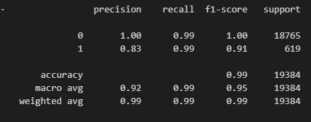
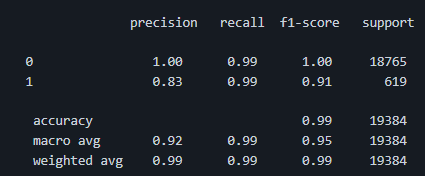

# Module 20 Supervised Machine Learning Report

## Overview of the Analysis

**Purpose:**

The Purpose of this analysis was to create a prediction model, which can be utilized to analyze credit worthiness of borrowers for the bank to putline any potential defaults.

The dataset provided contained just over 77,500 entried with specific indicators which are: Loan Size, Interest Rate,  Borrower's Income,  Number of regular payments for Borrower ,Detrimental factors on credit reportsand finally Borrowers total debt.

Within the dataset 3.2% of the total loans are in default. This was determined looking into the Loan Status columnn. The total value of loans amounted to over $760 Million, with over $46 Million. Default loans account for 6.08%, which when comapred to the total value could be seen as reasonable loss, however the bank has a duty to shareholders to reduce the amount wherever possible.

Initial steps involved removing the loan status column and storing in a seperate DataFrame, furthering on data features were split into training/ testing data, with a 75/25% split. Training Data was used in a Logistrical Regression model, resulting in a sctore of 0.99212 and testing score of 0.99184 which was used to predict test data and indiactors generated for balanced accuracy score, confusion matrix and class report.

Testing data then underwent random oversampling of the loan default status, with the purpose being to over-represent default loans to test the models predictive capabilities, the resulting data was composed of equal points for both healthy (0) and default(1) loans. A model was fit using Logistrical regression for resampled data which was then used to test Original data again. Further anlaysis was done on the feature data using StandardScalar, this prediction model yielded higher accruacy results than using raw data. Balanced accuracy increased by .379, precision dropped by 1% with recall incresing by 7%. The confusion matrix demonstrated a drop in false positives however false negatives did also increase. 

Therefore although the oversampled scaled data was accurate to 99% it demonstrated insignificant improvement over the use of raw data with the numbers being very similar, due to the drastic increase in false negatives rising, my recommendation would have been to continue using raw data when predicting.

## Results

Using bulleted lists, describe the balanced accuracy scores and the precision and recall scores of all machine learning models.

Machine Learning Model 1: Logistic Regression using data and Random Oversampling:

  Balanced Accuracy Score 0.9889115309798473
* Confusion Matrix results 
  
  True positive:  18652 
  
  False positive: 10
  
  True negative:  609
 
  False negative: 113

* Machine Learning Model 2: Logistic Regression using scaled data and Random Oversampling:

  Balanced Accuracy Score 0.9934383134311076
* Confusion Matrix results 
  
  True positive:  18640
  
  False positive: 4
  
  True negative:  615
 
  False negative: 125

## Summary

The main model used in this exercise was Logistic Regression with additional testing done with the model using scaled data and Random Oversampling. Testing yielded similar results in which 99% accuracy was adhered to. In the random sampling data, 4 false negatives were produced. However increased false positives were also produced. 

Increased accutacy of the model predicting healthy loans would allow the bank to restructure resources to areas in which they're needed to reduce the losses. With the prediction of healthy loans being acccurate, resources could focus on to use other measures in assessing health of loans and not solely rely on the model.

